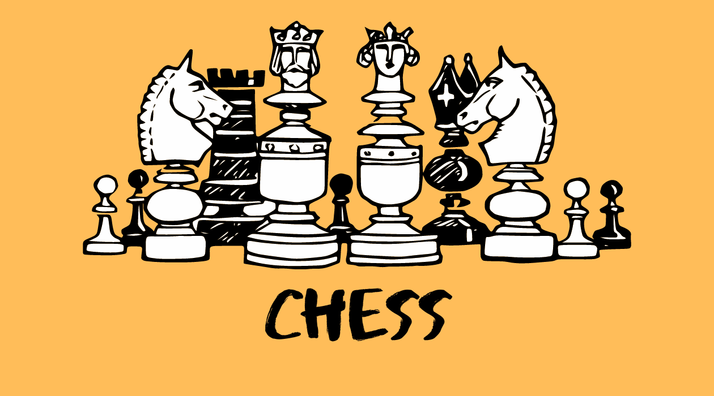
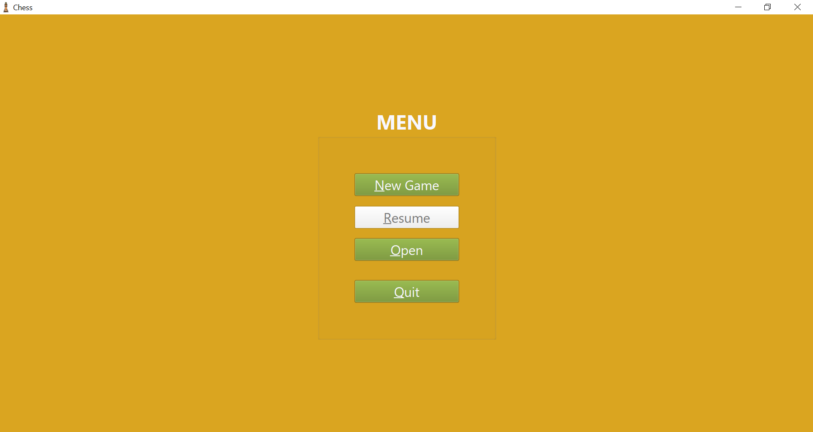
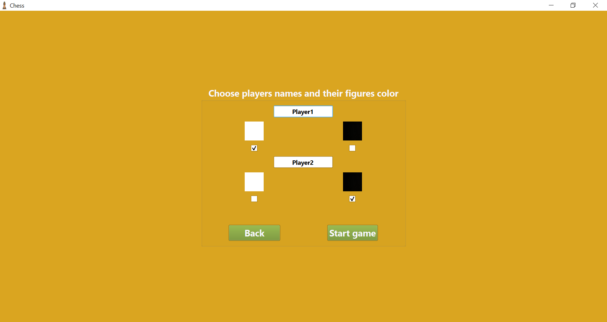
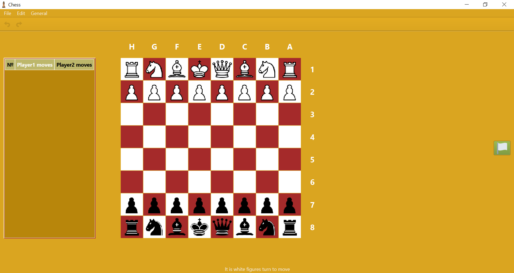

<h1 align="center"> Chess
  

  
</h1>

## Description
Hundreds of years have passed, but chess is still a popular game, and there are still millions of players, so... There is no problem to create thousands of chess applications. So, I would like to demonstrate my view of this old game in a modern computer wrapper.

## Main features
* Undo/Redo moves.
* Notating moves in long algebraic notation.
* Saving games and uploading them.

## Used technologies
Except for using C++17 features, the application has the following technologies stack:
* Classic design patterns (command, observer, state, template method, etc.). *When used appropriately, patterns help to simplify writing a good code.*
* MVC pattern. *It makes an application flexible to changes and its modules reusable.*
* OOP principles (encapsulation, inheritance, polymorphism, and abstraction). *The application has a class-based structure that uses an encapsulation principle. Chess figure classes are designed by using inheritance and abstraction to avoid unnecessary code and make it expandable. Furthermore, classes created via Qt features use these principles.*
* STL data structures (list, vector, queue, map, etc.) and algorithms. *Template-based data structures with methods for manipulating them are good storage for data. STL algorithms propose effective, ready-made solutions for popular tasks.*
* Qt (QtGUI, QtCore, QtWidget modules). *QtGUI module provides the basic application classes, such as QGuiApplication and QWindow. Applications cover a core Qt functionality such as the event system, signals/slots mechanism, container classes, the meta-object system, etc. To create a pretty application view, a wide range of QtWidget module functionality was used:*
  * Basic widgets (for example, QCheckBox, QLabel, QMenu, QPushButton).
  * Organizer widget and layout classes (for example, QButtonGroup, QGroupBox, QGridLayout).
  * Widget appearance and style-related classes (for example, QFont, QPalette, QColor).

## Widgets overview

### Menu widget

  
<b>Screenshot</b>

  
  |  | 
  | :--: | 
  | *Menu widget* |

After the application starts, the menu widget is shown to help the user navigate through the application:
1. `New Game` - start a new game. Opens a new game widget.
2. `Resume` - resume the last saved game or active game.
3. `Open` - open a previously saved chess game. Opens a file dialog window. 
4. `Quit` - quit the application.

### Start game widget

  
<b>Screenshot</b>

  
  |  | 
  | :--: | 
  | *Start game widget* |

There a user can choose:
* Figures color by using buttons programmed in a way not to stay in the same options.
* Players names. 
  **Names requirements**. Length from 3 to 10 symbols. Can be used with any symbol except space characters.

### End game widget
Widget notifying about game end. It can appear in such cases:
* Mate.
* Checkmate.
* Three times repeating position.
* Lack figures to mate.
* Giving up.
  
### Main window

  
<b>Screenshot</b>

  
  |  | 
  | :--: | 
  | *Main window* |

The most interesting part of the application is going here - playing chess on the virtual chessboard.
Also, the main part of the window has a moves history table demonstrating previously done moves written in long 
algebraic notation and a white flag that allows a player whose turn is to move to give up. Moving figure algorithm:
* A user can choose a figure to move by clicking on it.
* If the corresponding option is activated, all available moves will be highlighted.
* The next click will move the chosen figure to the new position, if it is available.
* If the corresponding option is activated, last move positions will be marked.
* Corresponding notation appears in the moves history table.

#### Status bar
Except for buttons' info tips, the status bar shows messages related to the game process, that can inform about:
* Which player is turn to move.
* Whether there is a check.
* Whether there is a need to choose a new figure.

#### Tool bar
`Undo`/`Redo` moves buttons are available here. Using it updates the chessboard view, makes history table notes, shows a status bar message, and if the corresponding option is activated, remarks last move positions.

#### Menu bar
* `File` - save/open the game.
* `Edit` - undo/redo movement and clear chessboard.
* `General` - manage move tips/last move tips options and return to the menu.

## General usage information
* To choose some options, shortcuts can be used by typing `Alt + key`.
* If the current game isn't saved, the dialog window will appear.
* Application windows can be resized, ensuring that the user interface as a whole remains usable.

## Some technical details
* `.appdata` file stores the last used default file name and last saved filename.
*  While interacting with the chessboard, only the needed regions are updated, not the whole window to avoid overhead video memory access.

## Project setup
On Windows platform: 
*Download [archive](./Chess_Release_win.rar) which has all needed application components (including Qt dll libraries). The application can be started by opening the `Chess.exe` file.*

On other platforms: 
*Go to the building [Building Qt Sources](https://doc.qt.io/qt-6/build-sources.html) guide to get more information.*

## Future scope
* Create a `CMake` file to provide custom application building for different platforms.
* Add a draw-proposing widget.
* Implement a timer to provide different game modes.
